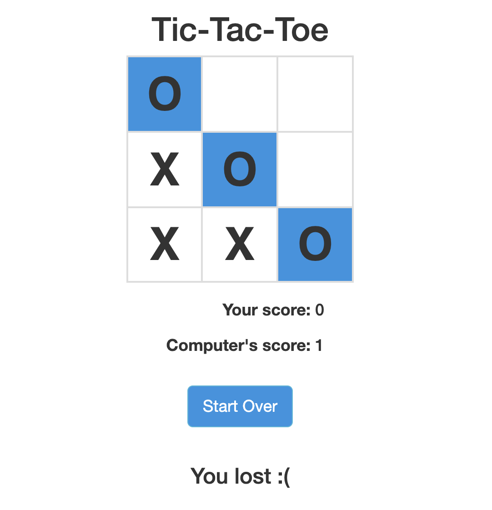

# TicTacToe-Flask
Lightweight tic tac toe game using Flask framework and Angular.  AI uses the minimax algorithm to calculate moves.  Good luck
trying to win.

## Install
```
pip install -r requirements.txt
```

## Run
```
python tictactoe.py
```

and navigate to `http://localhost:5000`

## Minimax
Inside [game.py](https://github.com/Buuntu/minimax-algorithm/blob/master/game.py#L31) 
is my implementation of the 
[minimax](https://en.wikipedia.org/wiki/Minimax) algorithm.




